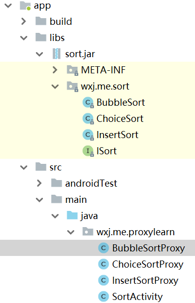
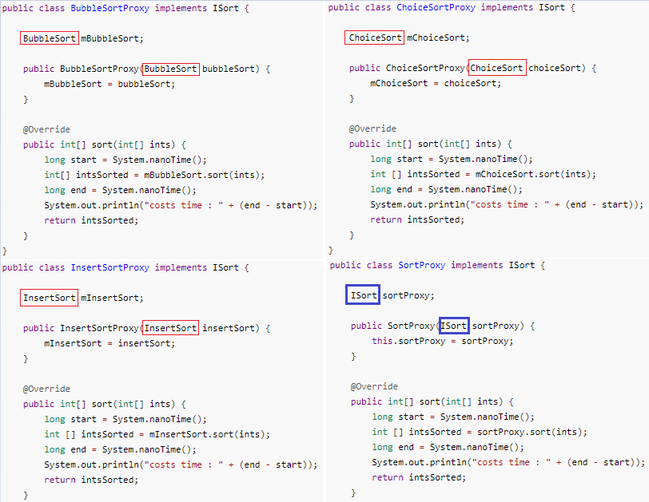

## Java 动态代理是什么？

**什么是动态代理**

Java 中的动态代理是指在运行时动态生成代理对象，这个对象是用来代理方法的，以实现方法的增强。

**为什么不在运行的时候动态的修改方法来增强方法，而要动态的生成一个对象？**

Java 中类一旦被加载装入到方法区就无法再修改了。要实现对方法的增强，在不修改原始类的情况下，有一种方式是，自己可以在编译前就创建一个类来对目标类中方法进行功能增强，具体实现可以了解静态代理模式。但是静态代理模式主要有两个缺陷：一是，静态代理是一对一的代理，当需要被代理的目标类增多时，需要自己创建多个代理类；另一方面，当目标类中的方法很多时，对于同样的代理逻辑要写多次，代码冗余严重。

而动态代理模式可以解决静态代理的缺点，一个代理类可以代理多个目标类。并且只要写一个代理逻辑方法，就可以对目标类中的所有方法进行增强。还有重要的一点是，动态代理可以在运行时动态的生成代理对象，并不需要在编译器前就要求创建好。


## 动态代理模实现与原理解析

[java动态代理实现与原理详细分析](https://www.cnblogs.com/gonjan-blog/p/6685611.html)


## 需求场景

现有一个 sort.jar 共包含一个 `ISort` 接口和三个实现类，分别为 `BubbleSort`（冒泡排序）、`ChoiceSort`（选择排序）和 `InsertSort`（插入排序）。

```java
//ISort 接口代码如下：
public interface ISort {
    int[] sort(int[] array);
}

//BubbleSort 伪代码如下：
public class BubbleSort implements ISort {
    public int[] sort(int[] array) {
        // 算法的具体实现
        return array;
    }
}
//ChoiceSort、InsertSort 代码与 BubbleSort 类似
```
现在要求项目引入这个 jar 包，并计算出这三种排序方式的耗时。

## 静态代理方式

完成上面需求有多种实现方式，下面我们给出一种方式来解决上面的问题。

`BubbleSort` 实现了 `ISort` 接口，我们创建一个 `BubbleSortProxy` 也实现 `ISort` 接口。要计算出 `BubbleSort` 排序消耗的时间，我们可以在排序前后记录下时间，通过计算前后的时间差就得到了排序消耗的时间。在 `BubbleSortProxy` 中我们引入 `BubbleSort` 作为其成员变量，方便调用 `BubbleSort` 中的 `sort(int[] array)` 方法。

`BubbleSortProxy` 代码如下:
```java
public class BubbleSortProxy implements ISort {

    BubbleSort mBubbleSort;

    public BubbleSortProxy(BubbleSort bubbleSort) {
        mBubbleSort = bubbleSort;
    }

    @Override
    public int[] sort(int[] ints) {
        long start = System.nanoTime();
        int[] intsSorted = mBubbleSort.sort(ints);
        long end = System.nanoTime();
        System.out.println("BubbleSort costs time : " + (end - start));
        return intsSorted;
    }
}
```
`ChoiceSortProxy` 与 `InsertSortProxy` 同 `BubbleSortProxy` 结构类似。

在 `SortActivity` 进行调用，调用代码如下：
```java

public class SortActivity extends AppCompatActivity {

    @Override
    protected void onCreate(Bundle savedInstanceState) {
        super.onCreate(savedInstanceState);
        setContentView(R.layout.activity_main);
        compareCostTime();
    }

    private void compareCostTime() {
   
        System.out.print("未排序数组顺序为：{4, 2, 8, 9, 5, 7, 6, 1, 3}");

        int[] unOrderedInts1 = new int[]{4, 2, 8, 9, 5, 7, 6, 1, 3};
        BubbleSortProxy bubbleSortProxy = new BubbleSortProxy(new BubbleSort());
        bubbleSortProxy.sort(unOrderedInts1);

        int[] unOrderedInts2 = new int[]{4, 2, 8, 9, 5, 7, 6, 1, 3};
        ChoiceSortProxy choiceSortProxy = new ChoiceSortProxy(new ChoiceSort());
        choiceSortProxy.sort(unOrderedInts2);

        int[] unOrderedInts3 = new int[]{4, 2, 8, 9, 5, 7, 6, 1, 3};
        InsertSortProxy insertSortProxy = new InsertSortProxy(new InsertSort());
        insertSortProxy.sort(unOrderedInts3);
    }

}

// 打印结果为：
14535-14535/wxj.me.proxylearn I/System.out: 未排序数组顺序为：{4 2 8 9 5 7 6 1 3}
14535-14535/wxj.me.proxylearn I/System.out: BubbleSort costs time : 16200
14535-14535/wxj.me.proxylearn I/System.out: ChoiceSort costs time : 16590
14535-14535/wxj.me.proxylearn I/System.out: InsertSort costs time : 16990
```
为了计算出三种算法的排序耗时，增加了三个类，每个类都包含了一个排序实现类。我们把`ChoiceSortProxy` 、`InsertSortProxy` 、 `BubbleSortProxy` 称为代理，把 `ChoiceSort `、`InsertSort`、 `BubbleSort`  称为被代理对象，也叫做目标对象，上面的这种实现方式叫做静态代理。

现在的项目主要结构如图1所示，假想如果 sort.jar 包中有10中排序方法，我们就会增加10个类，并且每个类的代码结构都是相同的。这种实现方式明显的缺点是：当排序实现类很多时，由于是1对1代理，增加了很多类。

 


## 创建 SortProxy

在下面的图2中，给出了`ChoiceSortProxy` 与 `InsertSortProxy` 同 `BubbleSortProxy` 三个类的代码。我们可以看到这三个类除了被代理对象的类型不同（不同的地方我用红色的框标出了），代码基本上完全一致。由于目标对象，它们在代理类中进行处理的逻辑是相同的，可以利用类的多态，使用一个代理类，就能对这三个目标对象进行代理，于是可以删掉 `ChoiceSortProxy` 、`InsertSortProxy` 、 `BubbleSortProxy` 这三个类，创建 `SortProxy` 来代理这三个目标对象。



 


## 动态创建代理类

从上一节我们实现了使用一个 `SortProxy` 替换掉了 `ChoiceSortProxy` 、`InsertSortProxy` 、 `BubbleSortProxy` 三个代理类。只要被代理的对象实现了 `ISort `接口，希望被测出排序消耗的时间这一需求，就可以用`SortProxy` 进行代理。

可见 `SortProxy` 只能代理实现了 `ISort` 接口的类，那如果现在有一个另外的需求

参考链接：

[10分钟看懂动态代理设计模式](https://www.jianshu.com/p/fc285d669bc5)
