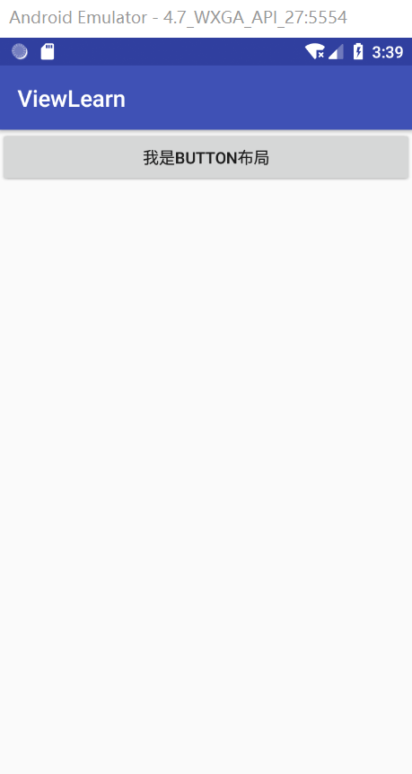
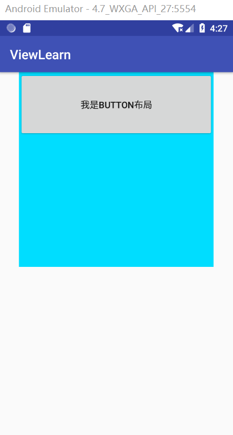

## LayoutInflater#inflate  解析笔记


### LayoutInflater 三种获取方式

1. Activity 里直接调用 `getLayoutInflater();`
2. `LayoutInflater layoutInflater = LayoutInflater.from(context);`
3. `LayoutInflater layoutInflater = (LayoutInflater) context.getSystemService(Context.LAYOUT_INFLATER_SERVICE);`

### LayoutInflater 三种方式之间的关系

Activity 调用 `getLayoutInflater();`

```java
    /**
     * Convenience for calling
     * {@link android.view.Window#getLayoutInflater}.
     */
    @NonNull
    public LayoutInflater getLayoutInflater() {
        // 调用 window 实例的getLayoutInflater() 方法
        return getWindow().getLayoutInflater(); 
    }
```

Window 实现类 PhoneWindow.java 中 layoutInflater 实例获得方式：

```java
    public PhoneWindow(Context context) {
        super(context);
        // 通过 LayoutInflater.from(context) 拿到 layoutInflater 实例；
        mLayoutInflater = LayoutInflater.from(context);
    }
```

LayoutInflater.from(context); 方法在 LayoutInlater.java 中的实现：

```java
public static LayoutInflater from(Context context) {
        // 最初始获得 LayoutInflater 实例的代码；
        LayoutInflater LayoutInflater = (LayoutInflater) context.getSystemService(Context.LAYOUT_INFLATER_SERVICE); 
        if (LayoutInflater == null) {
            throw new AssertionError("LayoutInflater not found.");
        }
        return LayoutInflater;
    }
```

通过上面的三个方法展示，可以看出：获取 LayoutInlfater 实例最初始的代码是 LayoutInflater.java 中的`(LayoutInflater) context.getSystemService(Context.LAYOUT_INFLATER_SERVICE);` 所以在任何时候我们都可以使用该方式获取到 LayoutInflater 实例。在 Activity 中调用 `getLayoutInflater()`更简单便捷，在可以获得 Context 的地方，可以调用简便方法 `LayoutInflater.from(context); `。


###  inflate() 重载方法分析

### inflate() 的4 个重载方法

`public View inflate(@LayoutRes int resource, @Nullable ViewGroup root)`

`public View inflate(XmlPullParser parser, @Nullable ViewGroup root)`

`public View inflate(@LayoutRes int resource, @Nullable ViewGroup root,boolean attachToRoot)`

`public View inflate(XmlPullParser parser, @Nullable ViewGroup root,boolean attachToRoot)`

前面三个方法最终都调用了第 4 种方法。

### `inflate(XmlPullParser parser, @Nullable ViewGroup root,boolean attachToRoot) ` 分析

具体实现代码如下：

```java
 public View inflate(XmlPullParser parser, @Nullable ViewGroup root, boolean attachToRoot) {
        synchronized (mConstructorArgs) {
            Trace.traceBegin(Trace.TRACE_TAG_VIEW, "inflate");

            final Context inflaterContext = mContext;
            final AttributeSet attrs = Xml.asAttributeSet(parser);
            Context lastContext = (Context) mConstructorArgs[0];
            mConstructorArgs[0] = inflaterContext;
            // 返回结果默认返回传入的 root
            View result = root;

            try {
                // Look for the root node.
                int type;
                while ((type = parser.next()) != XmlPullParser.START_TAG &&
                        type != XmlPullParser.END_DOCUMENT) {
                    // Empty
                }

                if (type != XmlPullParser.START_TAG) {
                    throw new InflateException(parser.getPositionDescription()
                            + ": No start tag found!");
                }

                final String name = parser.getName();

                if (DEBUG) {
                    System.out.println("**************************");
                    System.out.println("Creating root view: "
                            + name);
                    System.out.println("**************************");
                }

                // 1. 判断 TAG 是否是 merge，如果是 root 不能为空，并且 attacthToRoot 要设置为true
                if (TAG_MERGE.equals(name)) {
                    if (root == null || !attachToRoot) {
                        throw new InflateException("<merge /> can be used only with a valid "
                                + "ViewGroup root and attachToRoot=true");
                    }

                    rInflate(parser, root, inflaterContext, attrs, false);
                } else {
                    // Temp is the root view that was found in the xml
                    // 2. 将 xml 的根节点，解析成 View
                    final View temp = createViewFromTag(root, name, inflaterContext, attrs);

                    ViewGroup.LayoutParams params = null;
                    // 3. 如果 root 不为空，根据 xml 中的 attrs 生成 layoutParams；
                    // 如果 attachToRoot == false，则将生成的 layoutParams 设置给 xml 的根节点 View
                    if (root != null) {
                        if (DEBUG) {
                            System.out.println("Creating params from root: " +
                                    root);
                        }
                        // Create layout params that match root, if supplied
                        params = root.generateLayoutParams(attrs);
                        if (!attachToRoot) {
                            // Set the layout params for temp if we are not
                            // attaching. (If we are, we use addView, below)
                            temp.setLayoutParams(params);
                        }
                    }

                    if (DEBUG) {
                        System.out.println("-----> start inflating children");
                    }

                    // Inflate all children under temp against its context.
                    // 4. 将 xml 根 View 中包含的所有子节点，转化为 View
                    rInflateChildren(parser, temp, attrs, true);

                    if (DEBUG) {
                        System.out.println("-----> done inflating children");
                    }
                    // We are supposed to attach all the views we found (int temp)
                    // to root. Do that now.
                    // 5. 判断是否为 xml 解析成的 View 树，提供了父 View（root）
                    if (root != null && attachToRoot) {
                        root.addView(temp, params);
                    }
                  
                    // Decide whether to return the root that was passed in or the
                    // top view found in xml.
                    // 6.根据 root 和 attachToRoot 的值，最终判读是返回 root 还是返回 xml 解析的View 
                    if (root == null || !attachToRoot) {
                        result = temp;
                    }
                }

            } catch (XmlPullParserException e) {
                final InflateException ie = new InflateException(e.getMessage(), e);
                ie.setStackTrace(EMPTY_STACK_TRACE);
                throw ie;
            } catch (Exception e) {
                final InflateException ie = new InflateException(parser.getPositionDescription()
                        + ": " + e.getMessage(), e);
                ie.setStackTrace(EMPTY_STACK_TRACE);
                throw ie;
            } finally {
                // Don't retain static reference on context.
                mConstructorArgs[0] = lastContext;
                mConstructorArgs[1] = null;

                Trace.traceEnd(Trace.TRACE_TAG_VIEW);
            }

            return result;
        }
    }
```

我将 inflate() 方法的实现主要分为 6 个步骤：

`View result = root;`  用传入的 root 来初始化返回结构。接下来的主要步骤为：

1. 判断 xml 根节点是否是 merge，如果是则要求 root 不能为空，并且 attacthToRoot 要设置为 true；接着将 merge 下所有子节点转解析为 View；
2. 在根节点不是 merge 的情况下，首先将 xml 的根节点转换为 View；
3. 判断传入的 root 是否为空，不为空则根据 xml 的 attrs 生成 layoutParams，并在 attachToRoot == false 的情况下，将 layoutParams 设置给 xml 的顶级 View；
4. 将 xml 根 View 中包含的所有子节点，解析为 View；
5. 判断是否为 xml 解析成的 View 树，提供了父 View（root），当 root ！= null  &&  attachToRoot  == true 的情况下，将 xml 解析成的 View，加入到 root 中。
6. 根据 root 和 attachToRoot 的值，最终判读是返回 root 还是返回 xml 解析的View。 

### 实例运用

根据上一节对 inflate() 方法的分析，可以知道该方法返回的 View 有 3 种情况：

* 结果1：返回的 View 是根据 xml 布局文件解析成的 View 树，没有设置 layoutParams 参数；
* 结果2：返回的 View 是根据 xml 布局文件解析成的 View 树，并且设置 layoutParams 参数；
* 结果3：返回的 View 是传入的 root （ViewGroup），包含了 xml 布局文件解析成的 View 树。

#### root 与 attachToRoot 对返回值的影响

以上三种结果分别在什么情况下会返回呢？

1. 当 root == null，无论 attachToRoot  取值为什么，返回结果都为第一种情况；
2. 当 root != null，attachToRoot  取值为 false，返回的结果为第二种情况；
3. 当 root != null，attachToRoot  取值为 true，则返回的结果为第三种情况。

inflate() 重载方法是两个参数不传入 attachToRoot 时，root 不为 null 的情况下  attachToRoot  默认值为 true。 

#### 具体场景

三种不同返回结果，在具体的使用中有什么差异呢？我们通过一个例子来说明。

##### root == null 情景

创建一个 LayoutInflaterActivity.java，对应的布局文件为 activity_layout_inflater.xml。activity_layout_inflater 的代码如下：

```xml
<?xml version="1.0" encoding="utf-8"?>
<LinearLayout
    xmlns:android="http://schemas.android.com/apk/res/android"
    android:id="@+id/ll_activity"
    android:layout_width="match_parent"
    android:layout_height="match_parent"
    android:orientation="vertical">

</LinearLayout>
```

接着创建一个 button.xml 布局，设置了 layout_width="300dp"、android:layout_height="100dp" 代码如下：

```xml
<?xml version="1.0" encoding="utf-8"?>
<Button
    xmlns:android="http://schemas.android.com/apk/res/android"
    android:layout_width="300dp"
    android:layout_height="100dp"
    android:text="我是Button布局"/>
```


在 LayoutInflaterActivity.java 使用 inflate() 来加载布局，LayoutInflaterActivity.java 代码如下：

```java
public class LayoutInflaterActivity extends AppCompatActivity {

    @Override
    protected void onCreate(Bundle savedInstanceState) {
        super.onCreate(savedInstanceState);
        setContentView(R.layout.activity_layout_inflater);
        LinearLayout llActivity = findViewById(R.id.ll_activity);
        Button button = (Button) getLayoutInflater().inflate(R.layout.button_layout,null);
        llActivity.addView(button);
    }
}
```

运行效果如下：



运行结果有点意外，预期 button 的宽是 300dp、高是 100dp，运行结果却与预期不一致。

这就是我们说的 root == null 的情况，返回的 View  结果没有设置  LayoutParams  参数，当把 Button 通过addView(View child); 添加到 llActivity  中的时候，getLayoutParams() 返回是 null。addView(View child);内部调用了 addView(View child, int index);  如果没传递 index，index 默认值为 -1； addView(View child, int index);  实现如下：

```java
 public void addView(View child, int index) {
        if (child == null) {
            throw new IllegalArgumentException("Cannot add a null child view to a ViewGroup");
        }
        LayoutParams params = child.getLayoutParams();
        if (params == null) {
            params = generateDefaultLayoutParams();
            if (params == null) {
                throw new IllegalArgumentException("generateDefaultLayoutParams() cannot return null");
            }
        }
        addView(child, index, params);
    }
```

可见当 LayoutParams 为空的时候，或调用 generateDefaultLayoutParams(); 生成默认的 LayoutParams 。所以运行的结果没有按我们的预期显示。

##### root == null && attachToRoot == false 情景

现在我们修改 activity_layout_inflater.xml 布局，添加一个 FrameLayout 容器，修改后代码如下：

```xml
<?xml version="1.0" encoding="utf-8"?>
<LinearLayout
    xmlns:android="http://schemas.android.com/apk/res/android"
    android:id="@+id/ll_activity"
    android:layout_width="match_parent"
    android:layout_height="match_parent"
    android:orientation="vertical">

    <FrameLayout
        android:id="@+id/fl_container"
        android:layout_width="300dp"
        android:layout_height="300dp"
        android:layout_gravity="center_horizontal"
        android:background="@android:color/holo_blue_bright">

    </FrameLayout>

</LinearLayout>
```

LayoutInflaterActivity.java  中代码修改为：

```java
public class LayoutInflaterActivity extends AppCompatActivity {

    @Override
    protected void onCreate(Bundle savedInstanceState) {
        super.onCreate(savedInstanceState);
        setContentView(R.layout.activity_layout_inflater);
        LinearLayout llActivity = findViewById(R.id.ll_activity);
        FrameLayout flContainer = findViewById(R.id.fl_container);
        // 注意要设置 attachToRoot 为 false。不设置的话，默认 attachToRoot 为 true，返回的应该是 flContainer,强转为 button 会报转换异常
        Button button = (Button) getLayoutInflater().inflate(R.layout.button_layout,flContainer,false);
        llActivity.addView(button);
    }
}
```

运行效果：


我们可以看到，button 没有包含在  FrameLayout 中，大小也与我们预期相同。因为 button 设置的 layoutParams 在添加到 llActivity 中时生效了，验证了我们结果2。

##### root == null && attachToRoot == ture 情景

现在我们再修改一下 LayoutInflaterActivity.java 中的代码，将 button 添加到 FrameLayout 容器中：

```xml
public class LayoutInflaterActivity extends AppCompatActivity {

    @Override
    protected void onCreate(Bundle savedInstanceState) {
        super.onCreate(savedInstanceState);
        setContentView(R.layout.activity_layout_inflater);
        FrameLayout flContainer = findViewById(R.id.fl_container);
         // 强转为 FrameLayout，证明返回的是 flContainer，并不是 button
        FrameLayout inflateResult = (FrameLayout) getLayoutInflater().inflate(R.layout.button_layout,flContainer);
    }
}
```

运行效果：



可以看到返回的 View flContainer，并且包含了 button ，验证了结果3。


## 结尾

本篇笔记梳理了 LayoutInflater 的 inflate 过程，加强对布局加载的理解。


参考文章：

[Android LayoutInflater原理分析，带你一步步深入了解View(一)](https://blog.csdn.net/guolin_blog/article/details/12921889)

[View 绘制体系知识梳理(1) - LayoutInflater#inflate 源码解析](https://www.jianshu.com/p/49fca4c06eff)

# 
