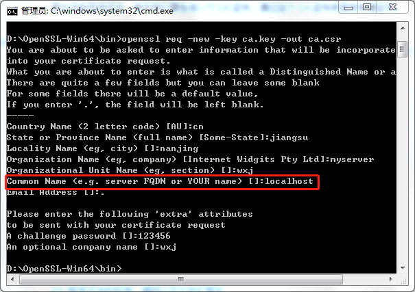
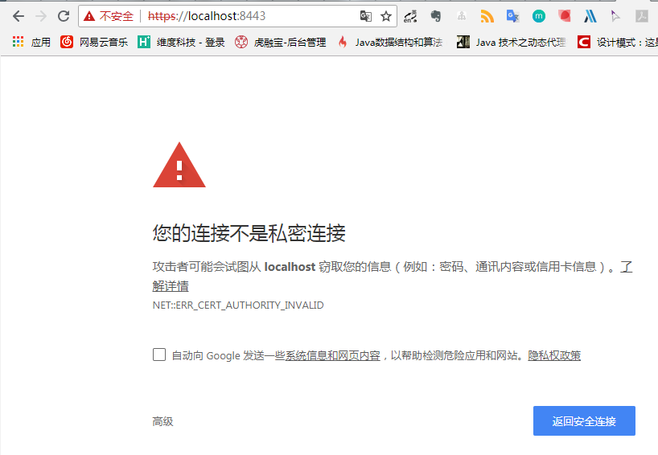

# 使用 OpenSSL 生成证书并在 tomcat 中配置 HTTPS

最近对项目进行优化，需要将客户端的 http 访问方式改为 https，需要验证 SSL 数字证书，于是研究了一下，自定义证书。查看了多篇博客，知道了可以利用Java 的 keytool 和 OpenSSL 来生成自定义证书。但与证书相关的各种编码和扩展名让人很困惑，比如经常看到的有 .pem、.der、.crt、.cer、.csr、.p12、X.509。写这篇文章主要是为了梳理一下思路，记录使用 openssl 生成证书的过程以及遇到的一些问题。


## 证书编码以及文件扩展名

前面说了，我们经常对 PEM、 .pem、DER、.der、.crt、.cer、.csr、.p12、X.509、PKCS 、.key、.jks 等这些后缀或格式感到困惑，我们来简单梳理一下。

上面的这些名词主要可以分为：证书标准、编码格式、扩展名。


### 证书标准

X.509 是 [ITU-T](https://zh.wikipedia.org/wiki/ITU-T) 标准化部门基于他们之前的 [ASN.1](https://zh.wikipedia.org/wiki/ASN.1) 定义的一套证书标准 。X.509 证书里含有公钥、身份信息（比如网络主机名，组织的名称或个体名称等）和签名信息（可以是证书签发机构CA的签名，也可以是自签名） 。


### 编码格式

X.509 标准的证书文件具有不同的编码格式，一般包括 PEM 和 DER 两种。不同格式的扩展名文件，可以选择相应的编码方式。

**PEM 编码格式**

PEM：Privacy Enhanced Mail 的缩写，以文本的方式进行存储。它的文件结构以 `-----BEGIN XXX-----`，并以 `-----END XXX-----` 结尾，中间 Body 内容为 Base64 编码过的数据。 

PEM 格式存储的证书结构大概如下：

```
-----BEGIN CERTIFICATE-----

Base64编码过的证书数据

-----END CERTIFICATE-----
```

可以通过如下 OpenSSL 命令可以查看其证书内容： 

```
openssl x509 -in xxx.pem -text -noout
```

公钥、私钥、证书签名请求文件都可以使用 PEM 格式进行编码。

一般 Apache 和 Nginx 服务器应用偏向于使用 PEM 这种编码格式。 

**DER 编码格式**

DER：Distinguished Encoding Rules 的缩写，以二进制方式进行存储，文件结构无法直接预览，可以通过如下 OpenSSL 命令查看其证书内容：

```
openssl x509 -in xxx.der -inform der -text -noout
```

一般 Java 和 Windows 服务器应用偏向于使用 `DER` 这种编码格式。 

**PKCS#12 （PFX/P12）编码格式 **

PKCS #12 ： PKCS（Public Key Cryptography Standards）公钥加密标准系列的一种，由 PFX 进化而来的用于交换公共的和私有的对象的标准格式。它定义了描述个人信息交换语法（Personal Information Exchange Syntax）的标准，可以用来将包含了公钥的 X.509 证书和证书对应的私钥以及其他相关信息打包。简单理解：**一份 .p12 文件 = X.509 证书+私钥**； 

**编码转换**

同一 X.509 证书的不同编码之间可以互相转换： 

- PEM 转为 DER：`openssl x509 -in xxx.pem -outform der -out xxx.der`
- DER 转为 PEM：`openssl x509 -in xxx.der -inform der -outform pem -out xxx.pem`
- PEM 转 PKCS#12： `openssl pkcs12 -export -out Cert.p12 -in cert.pem -inkey key.pem -passin pass:root -passout pass:root`


### 证书扩展名

介绍了编码格式，我们了解到对于 X.509 标准的证书两种不同编码格式，一般采用 PEM 编码就以 .pem 作为文件扩展名，若采用 DER 编码，就以 .der 作为扩展名。但常见的证书扩展名还包括 .crt、.cer、.p12 等，他们采用的编码格式可能不同，内容也有所差别，但大多数都能互相转换。X.509 还有多种常用的扩展名，如 .key、.csr、jks，不过其中的一些还用于其它用途，**就是说具有这个扩展名的文件可能并不是证书，比如说可能只是保存了私钥（如 .key）**。 

主要罗列如下： 

* **.pem：** 采用 PEM 编码格式的 X.509 证书的文件扩展名；

* **.der：** 采用 DER 编码格式的 X.509 证书的文件扩展名；

* **.p12：** 采用 PKCS#12 编码格式的 X.509 证书的扩展名；

* **.pfx：**  PKCS#12之前的格式（通常用 PKCS#12 格式，比如那些由 IIS 产生的 PFX 文件)

* **.crt：** certificate 的缩写，常用于 UNIX 系统，有可能是 PEM 编码，也有可能是 DER 编码，但绝大多数情况下此格式证书都是采用 PEM 编码方式；

* **.cer：** 也是 certificate 的缩写，常见于 Windows 系统，同样地，可能是 PEM 编码，也可能是 DER 编码，但绝大多数情况下此格式证书都是采用 DER 编码；

* **.csr：** Certificate Signing Request 的缩写，即证书签名请求，**它并不是证书的格式**，而是用于向权威证书颁发机构（Certificate Authority, CA）获得签名证书的申请，其核心内容包含一个 RSA 公钥和其他附带信息，在生成这个 `.csr` 申请的时候，同时也会生成一个配对 RSA 私钥，私钥通常需要严格保存于服务端，不能外泄。

* **.key**: 通常用来存放一个 RSA 公钥或者私钥，**它并非 X.509 证书格式**，编码同样可能是 PEM，也可能是 DER，查看方式如下：

  ``` 
  PEM 编码格式：openssl rsa -in xxx.key -text -noout
  DER 编码格式：openssl rsa -in xxx.key -text -noout -inform der
  ```

* **.jks:** 是 Java Key Storage 的缩写，是 java 用来存放密钥的文件。一般是用 java 的 keytool 工具进行生成。


## 使用 OpenSLL 生成自定义证书

HTTPS 网站所用的证书可向可信 CA 机构申请，不过 CA 机构基本都是商业机构，申请证书需要缴费，一般是按年缴费，费用因为 CA 机构的不同而不同。**如果只是 APP 与后台服务器进行HTTPS通信，可以使用 openssl 工具生成自签发的数字证书，可以节约费用，不过得妥善保护好证书私钥，不能泄露或者丢失。**HTTPS 通信所用的数字证书格式为X.509。 


### 生成 CA 证书

要生成自签发证书，首先我们要生成一个 CA 证书，通过这个 CA 证书来签发申请证书。

[OpenSSL下载链接 ](http://slproweb.com/products/Win32OpenSSL.html )

步骤为：生成 CA 私钥（.key）--> 生成 CA 证书签名请求（.csr） --> 给自己签发 CA 证书（.crt）

1 生成 CA 私钥（ca.key）`openssl genrsa -out ca.key 2048`

```
D:\OpenSSL-Win64\bin>openssl genrsa -out ca.key 2048
Generating RSA private key, 2048 bit long modulus
...................................................+++++
..........................................................+++++
e is 65537 (0x010001)
```

2 生成 CA 证书签名请求（ca.csr）`openssl req -new -key ca.key -out ca.csr `



在生成 CA 证书签名请求时需要填写一些组织信息，要主要一下 `Common Name` 这个字段，需要和网址的域名一致，这里提出来主要是提醒在服务器端需要生成向 CA 请求签名时，一定要填写网站域名，否则在客户端验证证书的时候会校验证书失败。

3 签发 CA 证书 ` openssl x509 -req -days 365 -in ca.csr -signkey ca.key -out ca.crt `

```
D:\OpenSSL-Win64\bin>openssl x509 -req -days 365 -in ca.csr -signkey ca ca.crt
Signature ok
subject=C = cn, ST = jiangsu, L = nanjing, O = myserver, OU = wxj, CN =
t
Getting Private key
```


###生成服务器证书

生成服务器端用户证书与生成 CA 证书步骤相同：

生成私钥（server.key）--> 生成证书签名请求（server.csr）-->用 CA 根证书签名得到证书（server.crt） 

```
// 1 生成服务端私钥
openssl genrsa -des3 -out server.key 1024
// 2 生成服务器端请求证书
openssl req -new -key server.key -out server.csr
// 3 用 CA 证书与服务器端的证书签名请求生成服务器端证书
openssl ca -in server.csr -out server.crt -cert ca file ca.key
```

在第 3 步生成服务端证书的时候，可能会遇到如下错误：

```
Using configuration from D:\OpenSSL-Win64\bin\openssl.cfg
ca: ./demoCA/newcerts is not a directory
./demoCA/newcerts: No such file or directory

Using configuration from D:\OpenSSL-Win64\bin\openssl.cfg
11192:error:02001002:system library:fopen:No such file or directory:crypto\bio\bss_file.c:74:fopen('./demoCA/index.txt','r')
11192:error:2006D080:BIO routines:BIO_new_file:no such file:crypto\bio\bss_file.
c:81:
```

解决方法：在当前目录下创建 demoCA 文件夹，在 demoCA  文件夹中再创建 newcerts  文件夹，例如文件目录为 `D:\OpenSSL-Win64\bin\demoCA\newcerts`；创建一空的 index.txt 文件；最后创建一个 serial 文件 ，不加后缀，在 serial 中写入 01。（index.txt、serial 与 newcerts 同级）。


## 在 tomact 中配置 ssl 证书信息

好了，到这里已经生成了服务器的证书（server.crt）和私钥(server.key)了。但 Tomcat 目前只能操作 `JKS`、`PKCS11`、`PKCS12` 格式的密钥存储库，下面要做证书转换。

**1. 准备服务器证书与私钥**

server.key、server.crt

**2. 合并证书**

```
openssl pkcs12 -export -in server.crt -inkey server.key -out server.p12 -name server
```

**注意：** -name 后面的 server 是指定的证书的别名，后面配置 tomcat8.5 之后的版本需要用到。如果忘记了可以通过 `keytool -list -keystore c:\www.what21.com.jks ` 命令查看。

**3. 生成 keystore 文件(该步骤可以省略，直接用 2 步骤中生成的 server.p12 可行)** 

```
keytool -importkeystore -srckeystore server.p12 -srcstoretype PKCS12 -destkeystore server.jks
```

**4. 配置tomcat**

tomcat 8.5 之前 

```xml
<Connector SSLEnabled="true" acceptCount="100" clientAuth="false"
    disableUploadTimeout="true" enableLookups="false" maxThreads="25"
    port="8443" keystoreFile="conf/server.jks" keystorePass="123456"
    protocol="org.apache.coyote.http11.Http11NioProtocol" scheme="https"
    secure="true" sslProtocol="TLS" />
```

tomcat 8.5 之后

```xml
<Connector port="8443" protocol="org.apache.coyote.http11.Http11NioProtocol"
               maxThreads="150" SSLEnabled="true">
        <SSLHostConfig>
            <Certificate certificateKeystoreFile="conf/server.jks"
            certificateKeystorePassword="123456"
            certificateKeyAlias="server"
                         type="RSA" />
        </SSLHostConfig>
    </Connector>
```

在浏览器中输入：https://localhost:8443 出现下面的界面，说明证书配置成功。



两点说明：

* tomcat 8.5 以后要配置证书的时候也要配置别名，即在第 2 步合并证书的时候 -name 后的别名，8.5 以前版本不需要别名；
* 这里我配置的是 .jks 后缀的 keystore 文件，其实不生成 server.jks 文件是完全可以的，直接使用 server.p12 亲测可行。

写着好累，去吃饭!【/飞起】


**参考文章：**

[SSL 数字证书的标准、编码以及文件扩展名](https://kangzubin.com/certificate-format/)

[X.509](https://zh.wikipedia.org/wiki/X.509)

[SSL中，公钥、私钥、证书的后缀名都是些啥？](https://www.zhihu.com/question/29620953)

[openssl生成SSL证书的流程](https://blog.csdn.net/liuchunming033/article/details/48470575)

[Android 安全开发之安全使用 HTTPS](https://juejin.im/entry/57f8b43775c4cd720956685d)

[Tomcat配置https证书](https://blog.csdn.net/u011719271/article/details/53784785)